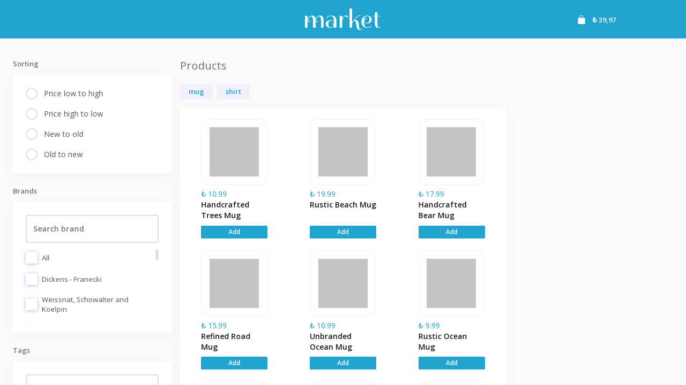

# Getir Market
### [Live Site on Heroku](https://serdarsen-getir-market.herokuapp.com/)

## Introduction
Getir Market is an implementation of my interview assignment given by Getir. This is a project that converts a [Figma design](./docs/design.fig) into a modern React application. You can find detailed information in [assignment.pdf](./docs/assignment.pdf).

## Implementation
* To be able to analyze in detail, I broke down the task into smaller pieces.
    * Creating main responsive layout struture. 
    * Transforming Figma element sizes and colors into React components using rem and em units. 
    * Creating components from scratch in order to obtain an easy-to-maintain codebase. 
    * Creating dev json server api.
    * Creating powerful global state management.
    * Testing and creating unit tests.
      
* I handled the context operations individually to have a separation of concerns.  
* I applied the Clean Code Naming Conventions and the Single Responsibility Principle to write clean tests.
  
* We have Redux, React-Redux, Redux-Saga, and Redux-Toolkit libraries to create a global state management infrastructure.
    *  I avoided using Redux because of [its suggestion to use Redux-Toolkit](https://redux.js.org/introduction/why-rtk-is-redux-today).
    *  I implemented React-Redux, Redux-Saga, and Redux-Toolkit libs to work together because of their efficiency.

### Feature

Focus points in this project :

- React Functional components and their reusability
- React file and folder structure
- Fundamental CSS properties to master flex & grid
- Fundamentals of the CSS BEM Model
- Perfectly placed media queries for satisfactory responsiveness covering almost devices (in development)
- Pixel Perfect Designs
- Powerful global state management
- Unit test coverage (in development)

### Tooling
- [React](https://reactjs.org): An open source JavaScript library for building UIs
  - [react](https://www.npmjs.com/package/react): Core React library
  - [@types/react](https://www.npmjs.com/package/@types/react): Type definitions for `React`
  - [react-dom](https://www.npmjs.com/package/react-dom): Renders React to DOM
  - [@types/react-dom](https://www.npmjs.com/package/@types/react-dom): Type definitions for `ReactDOM`
- [TypeScript](https://www.typescriptlang.org/): A strongly typed language built on top of JavaScript.
  - [typescript](https://www.npmjs.com/package/typescript): Core TypeScript programming language
  - [ts-node](https://www.npmjs.com/package/ts-node): TypeScript execution engine for Node.js
  - [@types/node](https://www.npmjs.com/package/@types/node): Type definitions for Node.js
- [Jest](https://jestjs.io/): A JavaScript testing framework
  - [jest](https://www.npmjs.com/package/jest): Core Jest library
  - [@types/jest](https://www.npmjs.com/package/@types/jest): TypeScript definitions for `jest`
  - [ts-jest](https://www.npmjs.com/package/ts-jest): A Jest transformer for TypeScript
  - [jest-environment-jsdom](https://www.npmjs.com/package/jest-environment-jsdom): Simulates a DOM environment during jest tests (See: [Jest DOM Manipulation Guide](https://jestjs.io/docs/tutorial-jquery))
  - [@testing-library/jest-dom](https://www.npmjs.com/package/@testing-library/jest-dom): Jest matchers (e.g. `toHaveClass`, `toBeChecked`) to test the state of the DOM
  - [@testing-library/react](https://www.npmjs.com/package/@testing-library/react): React DOM testing utilities (e.g. `.queryByText`, `.getByRole`)
- [Webpack](https://webpack.js.org/): An extensible static module bundler for JavaScript applications.
  - [webpack](https://www.npmjs.com/package/webpack): Core webpack bundler
  - [webpack-cli](https://www.npmjs.com/package/webpack-cli): CLI tooling for webpack (required for `npm` scripts that call `webpack`)
  - [webpack-dev-server](https://www.npmjs.com/package/webpack-dev-server): Development server with live reloading
  - [Loaders](https://webpack.js.org/loaders/)
    - [css-loader](https://www.npmjs.com/package/css-loader): Interprets and resolves `@import` and `url()` in CSS files when bundling
    - [style-loader](https://www.npmjs.com/package/style-loader): Injects CSS into the DOM when bundling
  - [Plugins](https://webpack.js.org/plugins/)
    - [html-webpack-plugin](https://www.npmjs.com/package/html-webpack-plugin): Generates HTML files when bundling

## Further Development
* The following topics can be considered for further development:
    * Add ability to save basket items and filters to database.
    * Refactor search widgets using a single reusable component.
    * Refactor widgets that include a checkbox or radio using a single reusable component.
    * Refactor context and service elements that have a similar structure using reusable modules.
    * Improve API error handling. Research and implement API best pratices like [Redux Toolkit Query](https://redux-toolkit.js.org/rtk-query/usage/examples)

## Usage
- The project built with `node v18.8.0` and `npm 8.18.0`.
- To be able to watch logs and develop locally, create `.env` file in the project root dir with a `DEV=true` property in it, then run `npm run dev-server` and `npm run dev` scripts in seperate terminals, browse `localhost:4000`.
- Run `npm run test` to run tests.

### Script
| Command                 | Description                                                                            |
| ----------------------- | -------------------------------------------------------------------------------------- |
| `npm install`           | Install all dependent application packages                                             |
| `npm run dev-server`        | Start json server at localhost:3004                                                    |
| `npm run dev`               | Start a local development web server at localhost:4000 using webpack-dev-server        |
| `npm run build`         | Bundle application for Production using webpack                                        |
| `npm run start`             | Serve static web site at localhost:8080 using express                                  |
| `npm run test`              | Run the full test suite using Jest                                                     |
| `npm run test:watch`    | Watch files for changes and rerun tests related to changed files                       |

## Reference
- [Webpack](https://webpack.js.org/)
- [ESLint](https://eslint.org/)
- [Figma](https://www.figma.com)
- [React-Redux](https://react-redux.js.org/)
- [Redux-Saga](https://redux-saga.js.org/)
- [Redux-Toolkit](https://redux-toolkit.js.org/)
- [Jest](https://jestjs.io/)
- [Animista](https://animista.net)
- [typicode/json-server](https://github.com/typicode/json-server)
- [reduxjs/cra-template-redux-typescript](https://github.com/reduxjs/cra-template-redux-typescript)
- [cloud-city-crafted/react-typescript-webpack-template](https://github.com/cloud-city-crafted/react-typescript-webpack-template)
